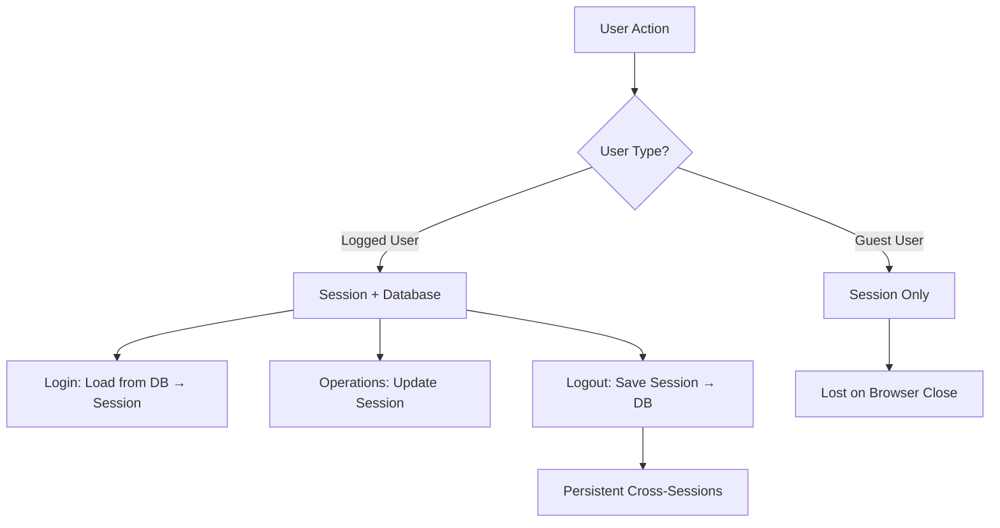

# 📚 TECHNICAL DOCUMENTATION - ECOM WEBSITE

## 🏗️ **KIẾN TRÚC HỆ THỐNG**

### **Tổng quan Architecture:**
- **Pattern:** MVC (Model-View-Controller) với Service Layer
- **Language:** PHP 8.0+ với OOP principles
- **Database:** MySQL 8.0 với PDO
- **Frontend:** HTML5, CSS3, Bootstrap 5, Vanilla JavaScript
- **Email:** PHPMailer với SMTP
- **Dependency Management:** Composer

### **Cấu trúc thư mục:**
```
Ecom_website/
├── app/
│   ├── controllers/          # Controllers xử lý HTTP requests
│   │   ├── admin/           # Admin controllers
│   │   ├── AuthController.php
│   │   ├── CustomerController.php
│   │   ├── CartController.php
│   │   └── CheckoutController.php
│   ├── models/              # Models xử lý database
│   │   ├── Product.php
│   │   ├── User.php
│   │   ├── Order.php
│   │   └── Category.php
│   ├── services/            # Business Logic Layer
│   │   ├── ProductService.php
│   │   ├── CartService.php
│   │   └── ReviewService.php
│   └── views/               # Frontend templates
├── configs/                 # Configuration files
├── core/                    # Core framework files
├── helpers/                 # Helper functions
├── public/                  # Static assets
└── vendor/                  # Composer dependencies
```

---

## 🔍 **SEARCH & FILTERING SYSTEM**

### **❌ Hiện tại KHÔNG sử dụng FULLTEXT Search**

**Implementation thực tế:**
```php
// ProductService.php - Dòng 113
if (!empty($filters['search'])) {
    $sql .= " AND (p.name LIKE :search OR p.description LIKE :search)";
    $params[':search'] = '%' . $filters['search'] . '%';
}
```

**Đặc điểm:**
- ✅ **LIKE Pattern Matching:** `%keyword%` search
- ❌ **Không có FULLTEXT Index**
- ❌ **Không có relevance scoring**
- ⚠️ **Performance:** Chậm với dữ liệu lớn

**Search Flow:**
1. User nhập từ khóa trong search box
2. JavaScript gửi request đến `/products?search=keyword`
3. `CustomerController::products()` nhận parameters
4. Gọi `ProductService::getProductsWithFilters()` với search filter
5. Thực hiện LIKE query trên `name` và `description`
6. Return kết quả với pagination

---

## 🛍️ **PRODUCT MANAGEMENT SYSTEM**

### **Core Models & Methods:**

#### **Product.php - Database Operations:**
```php
// CREATE operations
public function create($data)                    // Tạo sản phẩm mới
public function createVariants($productId, $variants)  // Tạo variants (size/color)
public function createWithVariants($productData, $variants)  // Tạo product + variants

// READ operations  
public function findById($id)                    // Lấy product theo ID
public function findBySlug($slug)               // Lấy product theo slug
public function getAllWithDetails()             // Lấy tất cả với thông tin đầy đủ
public function getBestSellers($limit)          // Sản phẩm bán chạy
public function getVariants($productId)         // Lấy tất cả variants

// UPDATE operations
public function update($id, $data)              // Cập nhật thông tin
public function updateStock($productId, $size, $color, $quantity)  // Cập nhật stock
public function decrementStock($productId, $size, $color, $quantity) // Giảm stock

// DELETE operations  
public function delete($id)                     // Soft delete
public function hardDelete($id)                 // Xóa vĩnh viễn

// IMAGE operations
public function getProductImages($productId)     // Lấy tất cả ảnh
public function getProductPrimaryImage($productId)  // Lấy ảnh chính
public function addProductImage($productId, $imagePath, $isPrimary)  // Thêm ảnh
```

#### **ProductService.php - Business Logic:**
```php
// MAIN QUERY FUNCTIONS - Được sử dụng nhiều nhất
public function getNewArrivals($limit = 8)           // ⭐ Sản phẩm mới nhất
public function getPopularProducts($limit = 8)       // ⭐ Sản phẩm phổ biến  
public function getProductsWithFilters($filters, $page, $limit)  // 🔥 Complex filtering

// SUPPORTING FUNCTIONS
public function getProductWithFullDetails($slugOrId) // Chi tiết sản phẩm
public function getRelatedProducts($productId, $limit) // Sản phẩm liên quan
public function getActiveCategories()                // Danh mục active
public function getActiveCollections()               // Bộ sưu tập active
public function getAvailableMaterials()             // Chất liệu có sẵn
```

### **🎯 Hàm được gọi nhiều nhất:**

#### **1. `getNewArrivals()` - Đơn giản & Hiệu quả**
```sql
SELECT p.*, c.collection_name
FROM products p 
LEFT JOIN collection c ON p.collection_id = c.collection_id 
WHERE p.is_active = 1 
ORDER BY p.created_at DESC
LIMIT $limit
```

**Được sử dụng tại:**
- 🏠 **Trang chủ:** Section "SẢN PHẨM MỚI NHẤT"
- 🔌 **API Endpoint:** `/api/new-arrivals?limit=7`
- 📱 **AJAX Call:** `fetch('/Ecom_website/api/new-arrivals?limit=7')`

#### **2. `getPopularProducts()` - Phức tạp hơn với Subquery**
```sql
SELECT p.*, c.collection_name 
FROM products p 
LEFT JOIN collection c ON p.collection_id = c.collection_id 
WHERE p.is_active = 1 
ORDER BY (
    SELECT COALESCE(SUM(oi.quantity), 0) 
    FROM order_items oi 
    JOIN orders o ON oi.order_id = o.order_id 
    WHERE oi.product_id = p.product_id 
    AND o.order_status IN ('paid', 'shipped', 'delivered')
) DESC, p.created_at DESC 
LIMIT $limit
```

**Được sử dụng tại:**
- 🏠 **Trang chủ:** Section "SẢN PHẨM PHỔ BIẾN NHẤT"  
- 🔌 **API Endpoint:** `/api/popular?limit=7`
- 📊 **Business Logic:** Tính toán dựa trên doanh số thực tế

---

## 🔄 **REQUEST FLOW - CHI TIẾT**

### **Flow 1: Trang chủ hiển thị sản phẩm**

```
1. Browser → GET /Ecom_website/
2. Router → CustomerController::index()
3. Controller gọi:
   - ProductService::getNewArrivals(8)
   - ProductService::getPopularProducts(8)
   - Category::getAllCategoriesWithBanners()
4. Service thực hiện SQL queries
5. Data trả về Controller
6. Controller render view 'customer/pages/home'
7. View hiển thị data với PHP templating
8. JavaScript AJAX load thêm data:
   - fetch('/Ecom_website/api/new-arrivals?limit=7')
   - fetch('/Ecom_website/api/popular?limit=7')
```

### **Flow 2: Tìm kiếm sản phẩm**

```
1. User nhập từ khóa → JavaScript bắt sự kiện
2. Browser → GET /products?search=keyword
3. Router → CustomerController::products()
4. Controller xây dựng filters array:
   filters = ['search' => 'keyword', 'sort_by' => 'newest']
5. Gọi ProductService::getProductsWithFilters(filters, page, limit)
6. Service build dynamic SQL với LIKE pattern:
   "AND (p.name LIKE '%keyword%' OR p.description LIKE '%keyword%')"
7. Execute query + data enrichment (images, ratings)
8. Return ['products' => array, 'total' => count]
9. Controller render 'customer/pages/list-product'
10. View hiển thị kết quả với pagination
```

### **Flow 3: AJAX API calls**

```
Frontend JavaScript:
fetch('/Ecom_website/api/new-arrivals?limit=7')
↓
Router: 'api/new-arrivals' => ['CustomerController', 'getNewArrivals']
↓  
CustomerController::getNewArrivals() {
    $products = $this->productService->getNewArrivals($limit);
    echo json_encode(['success' => true, 'data' => $products]);
}
↓
ProductService::getNewArrivals() executes SQL
↓
Response JSON về frontend
↓
JavaScript process data và render UI
```

---

## 💾 **DATABASE SCHEMA & QUERIES**

### **Các bảng chính:**

#### **products - Bảng sản phẩm chính**
```sql
CREATE TABLE products (
    product_id INT AUTO_INCREMENT PRIMARY KEY,
    name VARCHAR(255) NOT NULL,
    description TEXT,
    material ENUM('gold', 'silver', 'diamond', 'pearl'),
    base_price DECIMAL(10,2),
    sku VARCHAR(100),
    slug VARCHAR(255) UNIQUE,
    collection_id INT,
    is_active TINYINT(1) DEFAULT 1,
    main_image VARCHAR(255),  -- Backward compatibility
    created_at TIMESTAMP,
    updated_at TIMESTAMP
);
```

#### **product_variants - Biến thể sản phẩm**
```sql  
CREATE TABLE product_variants (
    variant_id INT AUTO_INCREMENT PRIMARY KEY,
    product_id INT,
    size VARCHAR(10),
    color VARCHAR(50), 
    price DECIMAL(10,2),
    stock INT DEFAULT 0,
    created_at TIMESTAMP,
    FOREIGN KEY (product_id) REFERENCES products(product_id)
);
```

#### **images & image_usages - Hệ thống quản lý ảnh**
```sql
-- Polymorphic image system
CREATE TABLE images (
    image_id INT AUTO_INCREMENT PRIMARY KEY,
    file_path VARCHAR(500),
    file_name VARCHAR(255),
    alt_text VARCHAR(255),
    created_at TIMESTAMP
);

CREATE TABLE image_usages (
    usage_id INT AUTO_INCREMENT PRIMARY KEY, 
    image_id INT,
    ref_type VARCHAR(50),  -- 'product', 'category', 'user'
    ref_id INT,            -- ID của đối tượng tham chiếu
    is_primary TINYINT(1) DEFAULT 0,
    created_at TIMESTAMP,
    FOREIGN KEY (image_id) REFERENCES images(image_id)
);
```

### **Query Examples thực tế:**

#### **1. Lấy sản phẩm với ảnh (ProductService):**
```sql
-- Main product query
SELECT p.*, c.collection_name 
FROM products p 
LEFT JOIN collection c ON p.collection_id = c.collection_id 
WHERE p.is_active = 1 
ORDER BY p.created_at DESC LIMIT 8;

-- Images cho mỗi product (loop)
SELECT i.*, iu.usage_id, iu.is_primary
FROM images i 
JOIN image_usages iu ON i.image_id = iu.image_id 
WHERE iu.ref_type = 'product' 
AND iu.ref_id = ? 
ORDER BY iu.is_primary DESC;

-- Rating stats cho mỗi product (loop)  
SELECT AVG(rating) as average_rating, COUNT(*) as total_reviews 
FROM reviews 
WHERE product_id = ? AND status = 'approved';
```

#### **2. Complex filtering (getProductsWithFilters):**
```sql
SELECT p.*, c.collection_name 
FROM products p 
LEFT JOIN collection c ON p.collection_id = c.collection_id 
WHERE p.is_active = 1
-- Dynamic filters được build runtime:
AND EXISTS (SELECT 1 FROM product_categories pc WHERE pc.product_id = p.product_id AND pc.category_id IN (1,3,5))
AND p.material IN ('gold', 'silver')  
AND p.base_price >= 100000
AND p.base_price <= 500000
AND (p.name LIKE '%nhẫn%' OR p.description LIKE '%nhẫn%')
ORDER BY (SELECT COALESCE(SUM(oi.quantity), 0) FROM order_items oi JOIN orders o ON oi.order_id = o.order_id WHERE oi.product_id = p.product_id AND o.order_status IN ('paid', 'shipped', 'delivered')) DESC
LIMIT 12 OFFSET 0;
```

---

## 🛒 **CART & CHECKOUT SYSTEM**

### **Cart Management:**
```php
// CartController methods
public function add()        // Thêm sản phẩm vào giỏ
public function update()     // Cập nhật số lượng  
public function remove()     // Xóa sản phẩm
public function clear()      // Xóa toàn bộ giỏ
public function count()      // Đếm số sản phẩm
```

### **Session-based Cart:**
```php
// Cấu trúc session cart
$_SESSION['cart'] = [
    'product_id_1' => [
        'product_id' => 1,
        'name' => 'Nhẫn kim cương',
        'price' => 5000000,
        'quantity' => 2,
        'size' => 'M', 
        'color' => 'Vàng',
        'image' => 'path/to/image.jpg'
    ],
    // ... more items
];
```

### **Checkout Process:**
```php
// CheckoutController::process()
1. Validate form data (name, email, phone, address)
2. Validate cart not empty
3. Check stock availability for each item
4. Calculate totals (subtotal, shipping, tax, total)
5. Generate unique order_id
6. Create order record
7. Create order_items records  
8. Update product stock (decrement)
9. Clear cart session
10. Redirect to success page
```

---

## 🔐 **AUTHENTICATION & SECURITY**

### **Authentication Flow:**
```php
// AuthController methods
public function signIn()     // Xử lý đăng nhập
public function signUp()     // Xử lý đăng ký
public function logout()     // Đăng xuất
public function verifyEmail() // Xác thực email
```

### **Security Measures:**
- ✅ **Password Hashing:** `password_hash()` với BCrypt
- ✅ **SQL Injection Prevention:** PDO prepared statements
- ✅ **XSS Protection:** `htmlspecialchars()` trong views  
- ✅ **CSRF Protection:** Session tokens (cần implement)
- ✅ **Input Validation:** Server-side validation
- ✅ **Email Verification:** Token-based verification

### **Session Management:**
```php
// SessionHelper methods  
public static function isLoggedIn()     // Kiểm tra trạng thái đăng nhập
public static function getUser()        // Lấy thông tin user
public static function login($user)     // Tạo session khi login
public static function logout()         // Xóa session khi logout
```

---

## 📱 **FRONTEND TECHNOLOGIES**

### **JavaScript - Vanilla JS (No jQuery):**
```javascript
// Modern Fetch API thay vì jQuery AJAX
fetch('/Ecom_website/api/new-arrivals?limit=7')
    .then(response => response.json())
    .then(data => {
        if (data.success) {
            renderProducts(data.data);
        }
    });

// Event handling
document.addEventListener('DOMContentLoaded', function() {
    // Initialize page functionality
    fetchProductData();
    loadWishlistStatus();
});
```

### **CSS Framework:**
- 🎨 **Bootstrap 5.3:** Responsive grid, components
- 🖼️ **Font Awesome:** Icons  
- 🎭 **Custom CSS:** Specific styling overrides

### **Key Frontend Features:**
- ✅ **Responsive Design:** Mobile-first approach
- ✅ **AJAX Loading:** Dynamic content without page refresh
- ✅ **Form Validation:** Client + Server side
- ✅ **Image Carousel:** Product galleries
- ✅ **Toast Notifications:** User feedback
- ✅ **Loading States:** UX improvements

---

## 📊 **ADMIN SYSTEM**

### **Admin Controllers:**
```php
// admin/ namespace controllers
DashboardController     // Thống kê tổng quan
ProductsController      // Quản lý sản phẩm
CategoriesController    // Quản lý danh mục
OrdersController        // Quản lý đơn hàng
CustomersController     // Quản lý khách hàng
```

### **Key Admin Features:**
- 📋 **Product Management:** CRUD với image upload
- 📊 **Dashboard Analytics:** Sales, orders, customers stats
- 🛍️ **Order Management:** View, update order status
- 👥 **Customer Management:** User accounts, roles
- 📂 **File Upload:** Multiple image handling

---

## 🔧 **ADMIN PANEL - QUẢN LÝ ĐƠN HÀNG VÀ SẢN PHẨM**

### **📦 Hệ Thống Quản Lý Đơn Hàng (Orders Management)**

#### **OrdersController Architecture**

**File:** `app/controllers/admin/OrdersController.php`

**Kế thừa:** `BaseController` (MVC Pattern)

**Dependencies Injected:**
- Order Model (`$this->orderModel`)
- EmailHelper (`helpers/email_helper.php`)

**Phương thức chính:**

```php
// Hiển thị danh sách đơn hàng
public function index()

// Cập nhật trạng thái thanh toán (POST only)
public function updatePayment()

// Cập nhật trạng thái đơn hàng (POST only) 
public function updateOrder()

// Hiển thị chi tiết đơn hàng với inline edit
public function showDetails()

// Xóa đơn hàng (soft delete)
public function delete()

// Xóa vĩnh viễn đơn hàng (hard delete)
public function hardDelete()
```

#### **Order Status Management**

**Payment Status:**
- `unpaid`: Chưa thanh toán (màu warning)
- `paid`: Đã thanh toán (màu success)

**Order Status:**
- `pending`: Chờ xác nhận (màu warning)
- `confirmed`: Đã xác nhận (màu info)
- `shipping`: Đang giao hàng (màu primary)
- `delivered`: Đã giao hàng (màu success)
- `cancelled`: Đã hủy (màu danger)

#### **Email Notification System**

**Tự động gửi email khi:**
- Payment status chuyển thành `paid`
- Chỉ áp dụng với phương thức thanh toán `bank_transfer`

**Implementation:**
```php
private function sendPaymentConfirmationEmail($orderId) {
    $order = $this->orderModel->getOrderWithCustomerEmail($orderId);
    $paymentMethod = $order->payment_method;
    
    if ($paymentMethod === 'bank_transfer') {
        $emailSent = EmailHelper::sendPaymentConfirmationEmail($order);
        // Log và session feedback
    }
}
```

#### **Orders View Components**

**File:** `app/views/admin/pages/orders.php`

**Features:**
- Responsive table/card layout (desktop/mobile)
- Inline status updates với dropdown
- Real-time AJAX status changes
- Modal confirmations cho delete operations
- Bootstrap 5 UI components

**JavaScript Functions:**
```javascript
// Cập nhật trạng thái thanh toán
updatePaymentStatus(orderId, status)

// Cập nhật trạng thái đơn hàng  
updateOrderStatus(orderId, status)

// Edit/Delete operations
editOrder(orderId)
deleteOrder(orderId)
```

### **🛍️ Hệ Thống Quản Lý Sản Phẩm (Products Management)**

#### **ProductsController Architecture**  

**File:** `app/controllers/admin/ProductsController.php`

**Dependencies Injected:**
- Product Model (`$this->productModel`)
- Category Model (`$this->categoryModel`)  
- Collection Model (`$this->collectionModel`)

**Upload Configuration:**
```php
private $uploadPath = '/public/uploads/products/';
private $allowedExtensions = ['jpg', 'jpeg', 'png', 'gif', 'webp'];
private $maxFileSize = 5242880; // 5MB
```

#### **Product CRUD Operations**

**Create Product Flow:**
1. `showAddForm()` - Hiển thị form với dropdowns data
2. `create()` - POST validation và tạo product + variants
3. Image upload với organized folder structure
4. Category attachment (many-to-many)

**Update Product Flow:**
1. `showEditForm()` - Tái sử dụng add-product.php với data
2. `update()` - POST validation và cập nhật
3. Variants replacement (xóa cũ + thêm mới)
4. Category re-attachment

**Product Variants System:**
```php
// Variants structure trong POST data
$_POST['variants'] = [
    ['size' => 'S', 'color' => 'Vàng', 'price' => 1500000, 'stock' => 10],
    ['size' => 'M', 'color' => 'Bạc', 'price' => 1800000, 'stock' => 5]
];
```

#### **Image Management System**

**Database Schema:**
- `images` table: Lưu file paths
- `image_usages` table: Polymorphic relationships
- `products.main_image`: Backward compatibility

**Upload Implementation:**
```php
private function handleProductImages($productId, $files) {
    // Tạo product folder: /uploads/products/{productId}/
    // Generate unique filenames
    // Save vào images + image_usages tables
    // Update main_image column
}
```

**Image Display Logic:**
```php
// Priority: primary_image từ image_usages
if (!empty($product->primary_image->file_path)) {
    $imageSrc = '/Ecom_website/' . $product->primary_image->file_path;
}
// Fallback: main_image column  
elseif (!empty($product->main_image)) {
    $imageSrc = '/Ecom_website/' . $product->main_image;
}
// Default placeholder
else {
    $imageSrc = 'https://via.placeholder.com/40x40?text=No+Image';
}
```

#### **Category Association**

**Many-to-Many Implementation:**
- Table: `product_categories` (product_id, category_id)
- Support both single và multi-select
- Xóa associations cũ và tạo mới khi update

```php
private function attachCategoriesToProduct($productId, $categoryIds) {
    // DELETE old associations
    // INSERT new associations
    // Support cả category_id (single) và category_ids[] (multi)
}
```

#### **Products View Components**

**File:** `app/views/admin/pages/products.php`

**Features:**
- Responsive design (table desktop, cards mobile)
- Real-time search filtering
- Image fallback system
- Status badges với color coding
- Modal confirmations cho delete operations

**Product Display Information:**
- Product image từ database
- Name, SKU, material badges
- Category và collection info
- Pricing với VND formatting
- Status (Đang bán/Ngừng bán)
- Creation date và time

#### **Validation System**

**Product Data Validation:**
```php
private function validateProductData($data) {
    // Name: minimum 3 characters
    // Price: positive number
    // SKU: not empty
    // Variants: at least 1 variant required
    // Variant fields: size, color, price, stock validation
}
```

### **🗄️ Database Models và Relationships**

#### **Order Model Methods**

**File:** `app/models/Order.php`

**Key Methods:**
```php
getAllOrders()                    // JOIN với users table
getOrderDetails($orderId)         // Chi tiết đơn hàng  
getOrderItems($orderId)          // Items với product info
updatePaymentStatus($id, $status) // Cập nhật payment
updateStatus($id, $status)       // Cập nhật order status
getOrderWithCustomerEmail($id)   // Lấy email cho gửi thông báo
```

#### **Product Model Methods**

**Image Management:**
```php
getProductImages($productId)         // Load từ image_usages
getProductPrimaryImage($productId)   // Primary image only
addProductImage($productId, $path, $isPrimary) // Insert vào database
```

**Variants Management:**
```php
getProductVariants($productId)    // Load variants
createWithVariants($data, $variants) // Tạo product + variants
```

## 8. Trang Chi Tiết Sản Phẩm (Product Detail Page)

### 8.1 CustomerController - Product Detail Architecture

#### 8.1.1 Controller Method

**File:** `app/controllers/CustomerController.php`

**Method:** `productDetail($id)`

**Flow xử lý:**
1. Gọi `ProductService::getProductWithFullDetails($id)`
2. Load related products (4 sản phẩm)
3. Prepare data cho view
4. Render `customer/pages/details-product.php`

```php
public function productDetail($id) {
    // Service Layer call
    $product = $this->productService->getProductWithFullDetails($id);
    
    if (!$product) {
        $this->view('customer/pages/404', ['message' => 'Không tìm thấy sản phẩm']);
        return;
    }
    
    // Load related products
    $relatedProducts = $this->productService->getRelatedProducts($product->product_id, 4);
    
    // Data for view
    $data = [
        'title' => $product->name,
        'product' => $product, 
        'relatedProducts' => $relatedProducts
    ];
    
    $this->view('customer/pages/details-product', $data);
}
```

#### 8.1.2 ProductService - Full Details Loading

**Method:** `getProductWithFullDetails($slugOrId)`

**Data aggregation:**
```php
// Core product data
$product = $this->productModel->findBySlug($slugOrId);

// Fallback to ID lookup if slug fails
if (!$product && is_numeric($slugOrId)) {
    $product = $this->productModel->findById($slugOrId);
}

// Attach comprehensive data
$product->images = $this->getProductImages($product->product_id);
$product->primary_image = $this->getProductPrimaryImage($product->product_id);
$product->categories = $this->getProductCategories($product->product_id);
$product->variants = $this->productModel->getAvailableVariants($product->product_id);
$product->variant_options = $this->getVariantOptions($product->product_id);
$product->reviews = $this->reviewService->getProductReviews($product->product_id, 10);
$product->review_stats = $this->reviewService->getProductReviewStats($product->product_id);
```

### 8.2 View Architecture và Components

#### 8.2.1 File Structure

**Main View:** `app/views/customer/pages/details-product.php`

**Key Components:**
- Header component (`components/header.php`)
- Footer component (`components/footer.php`)
- Product detail JavaScript (`js/product-detail.js`)
- Custom CSS (`css/css.css`)

#### 8.2.2 Page Layout Structure

**1. Breadcrumb Navigation:**
```php
<nav aria-label="breadcrumb">
    <ol class="breadcrumb">
        <li><a href="<?= url('') ?>">Trang chủ</a></li>
        <li><a href="<?= route('products') ?>">Trang sức</a></li>
        <?php if (isset($product->categories[0])): ?>
            <li><a href="<?= route('products', ['category' => $product->categories[0]->category_id]) ?>">
                <?= htmlspecialchars($product->categories[0]->name) ?>
            </a></li>
        <?php endif; ?>
        <li class="active"><?= htmlspecialchars($product->name) ?></li>
    </ol>
</nav>
```

**2. Product Images Gallery:**
- **Desktop Layout:** Thumbnails + main image
- **Mobile Layout:** Slider với navigation dots
- **Features:** Click to change, responsive design, lazy loading

**3. Product Information Panel:**
- Product name và rating
- Price display với VND formatting
- Product description
- Variant options (size, color)
- Quantity selector
- Action buttons (Add to cart, Buy now)
- Delivery information

**4. Product Tabs:**
- Description tab
- Additional information tab  
- Reviews tab với review count

**5. Related Products Section:**
- 4 sản phẩm cùng collection
- Card layout với hover effects
- Quick action buttons

#### 8.2.3 Image Gallery System

**Responsive Image Display:**

**Desktop Version:**
```php
<div class="desktop-gallery">
    <div class="col-2">
        <div class="thumbnail-container">
            <?php foreach ($product->images as $index => $image): ?>
                <div class="thumbnail-item <?= $index === 0 ? 'active' : '' ?>" 
                     onclick="changeImage(this, '<?= asset($image->file_path) ?>')">
                    file_path) ?>" 
                         alt="<?= htmlspecialchars($image->alt_text ?: $product->name) ?>">
                </div>
            <?php endforeach; ?>
        </div>
    </div>
    <div class="col-10">
        <div class="main-image">
            primary_image->file_path) ?>" 
                 alt="<?= htmlspecialchars($product->name) ?>">
        </div>
    </div>
</div>
```

**Mobile Version:**
```php
<div class="mobile-gallery">
    <div class="gallery-slider">
        <?php foreach ($productImages as $index => $image): ?>
            <div class="gallery-slide <?= $index === 0 ? 'active' : '' ?>" data-index="<?= $index ?>">
                file_path ?>" alt="<?= $altText ?>" loading="lazy">
            </div>
        <?php endforeach; ?>
    </div>
    
    <!-- Navigation controls -->
    <button class="gallery-nav prev" onclick="prevSlide()">
        <i class="fas fa-chevron-left"></i>
    </button>
    <button class="gallery-nav next" onclick="nextSlide()">
        <i class="fas fa-chevron-right"></i>
    </button>
    
    <!-- Dots navigation -->
    <div class="gallery-dots">
        <?php foreach ($productImages as $index => $image): ?>
            <button class="gallery-dot <?= $index === 0 ? 'active' : '' ?>" 
                    onclick="goToSlide(<?= $index ?>)"></button>
        <?php endforeach; ?>
    </div>
</div>
```

#### 8.2.4 Product Variants System

**Variant Options Display:**
```php
<?php if (isset($product->variant_options['colors'])): ?>
<div class="option-group">
    <label>Loại:</label>
    <div class="color-options type-options">
        <?php foreach ($product->variant_options['colors'] as $index => $color): ?>
            <button class="option-btn <?= $index === 0 ? 'active' : '' ?>" 
                    onclick="selectOption(this)">
                <?= htmlspecialchars($color) ?>
            </button>
        <?php endforeach; ?>
    </div>
</div>
<?php endif; ?>

<?php if (isset($product->variant_options['sizes'])): ?>
<div class="option-group">
    <label>Size:</label>
    <div class="size-options type-options">
        <?php foreach ($product->variant_options['sizes'] as $index => $size): ?>
            <button class="option-btn <?= $index === 0 ? 'active' : '' ?>" 
                    onclick="selectOption(this)">
                <?= htmlspecialchars($size) ?>
            </button>
        <?php endforeach; ?>
    </div>
</div>
<?php endif; ?>
```

#### 8.2.5 Reviews System Integration

**Reviews Tab Content:**
- Review statistics từ `ReviewService`
- Individual reviews display
- Review form (authenticated users only)
- Login prompt cho unauthenticated users

```php
// Review stats display
$avgRating = ($reviewStats && isset($reviewStats->average_rating)) 
    ? round($reviewStats->average_rating) 
    : 5;

// Review form authentication check
<?php if (isset($_SESSION['user_id'])): ?>
    <form id="reviewForm" class="needs-validation" novalidate>
        <!-- Review form fields -->
    </form>
<?php else: ?>
    <div class="card">
        <div class="card-body text-center py-5">
            <i class="fas fa-user-lock fa-3x text-muted mb-3"></i>
            <h5 class="text-muted mb-3">Đăng nhập để đánh giá sản phẩm</h5>
            <a href="<?= url('auth/signin') ?>" class="btn btn-primary">
                <i class="fas fa-sign-in-alt me-2"></i>Đăng nhập
            </a>
        </div>
    </div>
<?php endif; ?>
```

### 8.3 JavaScript Functionality

#### 8.3.1 Core JavaScript Features

**File:** `public/js/product-detail.js`

**Key Functions:**
- Image gallery navigation
- Variant selection handling  
- Add to cart functionality
- Buy now processing
- Tab switching
- Review form submission

#### 8.3.2 Cart Integration

**Add to Cart Function:**
```javascript
function addToCart() {
    // Get selected variants
    const selectedColor = getSelectedOption('.color-options');
    const selectedSize = getSelectedOption('.size-options');
    const quantity = document.getElementById('quantityInput').value;
    
    // AJAX call to CartController
    fetch('/cart/add', {
        method: 'POST',
        headers: {
            'Content-Type': 'application/json',
        },
        body: JSON.stringify({
            product_id: productId,
            color: selectedColor,
            size: selectedSize,
            quantity: quantity
        })
    })
    .then(response => response.json())
    .then(data => {
        if (data.success) {
            // Show success message
            // Update cart count
        }
    });
}
```

### 8.4 Related Products System

#### 8.4.1 Related Products Logic

**ProductService Method:**
```php
public function getRelatedProducts($productId, $limit = 4) {
    $product = $this->productModel->findById($productId);
    
    if (!$product || !$product->collection_id) {
        return [];
    }
    
    // Lấy sản phẩm cùng collection, exclude current product
    $sql = "SELECT * FROM products 
            WHERE collection_id = :collection_id 
            AND product_id != :product_id 
            AND is_active = 1 
            ORDER BY RAND() 
            LIMIT :limit";
}
```

#### 8.4.2 Related Products Display

**Features:**
- 4-column responsive grid
- Product card hover effects
- Quick actions (wishlist, compare, add to cart)
- Image fallback system
- Price formatting

### 8.5 SEO và Performance Optimizations

#### 8.5.1 SEO Features

- **Dynamic page titles:** Product name as title
- **Breadcrumb navigation:** Structured navigation
- **Meta descriptions:** Product descriptions
- **Image alt tags:** Proper accessibility
- **URL structure:** SEO-friendly product URLs

#### 8.5.2 Performance Features

- **Lazy loading:** Images load on demand
- **Image optimization:** Responsive image sizing
- **AJAX interactions:** No page reload for actions
- **Efficient queries:** Service layer optimizations
- **Caching opportunities:** Related products, reviews

---

## 🔌 **API ENDPOINTS**

### **Public APIs:**
```
GET /api/new-arrivals?limit=8          → CustomerController::getNewArrivals()
GET /api/popular?limit=8               → CustomerController::getPopularProducts()  
GET /api/categories                    → CustomerController::getCategories()
GET /api/collections/list              → CollectionController::getCollectionsApi()
POST /api/reviews/add                  → ReviewController::add()
```

### **Cart APIs:**
```
POST /cart/add                         → CartController::add()
POST /cart/update                      → CartController::update() 
POST /cart/remove                      → CartController::remove()
GET /cart/count                        → CartController::count()
```

### **Wishlist APIs:**  
```
POST /wishlist/toggle                  → WishlistController::toggle()
GET /wishlist/status                   → WishlistController::status()
POST /wishlist/add                     → WishlistController::add()
```

---

## 📈 **PERFORMANCE CONSIDERATIONS**

### **Database Optimizations:**
- ✅ **Indexes:** Primary keys, foreign keys, created_at
- ⚠️ **Missing:** FULLTEXT indexes cho search
- ✅ **Query Optimization:** SELECT specific columns
- ✅ **Pagination:** LIMIT/OFFSET cho large datasets

### **Caching Strategy:**
- ❌ **No Caching:** Chưa implement Redis/Memcached  
- ⚠️ **Opportunity:** Cache popular products, categories
- ✅ **Session Management:** PHP sessions

### **Image Handling:**
- ✅ **Organized Storage:** Polymorphic image system
- ⚠️ **Missing:** Image compression, CDN
- ✅ **Fallback Images:** Placeholder khi không có ảnh

---

## 🚀 **DEPLOYMENT & ENVIRONMENT**

### **Development Stack:**
- 🖥️ **Server:** XAMPP (Apache + MySQL + PHP)
- 🐘 **PHP:** 8.0+ với extensions (PDO, GD, CURL)
- 🗄️ **Database:** MySQL 8.0
- 📧 **Email:** SMTP configuration với PHPMailer

### **File Structure:**
```
/public/uploads/          # User uploaded files
/vendor/                  # Composer dependencies  
/configs/                 # Configuration files
/logs/                    # Error logs (cần tạo)
```

### **Configuration Files:**
- `configs/database.php` - Database connection
- `configs/email.php` - SMTP settings  
- `configs/env.php` - Environment variables
- `.htaccess` - URL rewriting rules

---

## 📝 **CODE STANDARDS & BEST PRACTICES**

### **Coding Standards:**
- ✅ **PSR-4 Autoloading:** Class naming conventions
- ✅ **MVC Separation:** Clear separation of concerns  
- ✅ **OOP Principles:** Encapsulation, inheritance
- ✅ **Error Handling:** Try-catch blocks
- ✅ **Input Validation:** Server-side validation

### **Naming Conventions:**
- **Classes:** `PascalCase` (ProductController)
- **Methods:** `camelCase` (getNewArrivals) 
- **Variables:** `camelCase` ($productData)
- **Constants:** `UPPER_CASE` (BASE_URL)
- **Database:** `snake_case` (product_id, created_at)

---

## 🔧 **TROUBLESHOOTING COMMON ISSUES**

### **Database Connection:**
```php
// configs/database.php - Kiểm tra credentials
'host' => 'localhost',
'dbname' => 'ecom_website', 
'username' => 'root',
'password' => ''
```

### **Image Upload Issues:**
```php
// Kiểm tra permissions
chmod 755 public/uploads/
// Kiểm tra PHP settings
upload_max_filesize = 10M
post_max_size = 10M
```

### **Session Problems:**
```php
// Ensure sessions are started
session_start();
// Check session save path
ini_get('session.save_path');
```

---

## 📚 **FUTURE IMPROVEMENTS**

### **Recommended Enhancements:**

1. **Search System:**
   - ✨ Implement FULLTEXT search với relevance scoring
   - ✨ Add search suggestions/autocomplete
   - ✨ Search analytics và popular searches

2. **Performance:**  
   - ✨ Implement caching layer (Redis)
   - ✨ Add CDN cho static assets
   - ✨ Database query optimization

3. **Security:**
   - ✨ Implement CSRF protection  
   - ✨ Add rate limiting cho APIs
   - ✨ Enhanced input validation

4. **Features:**
   - ✨ Real-time notifications
   - ✨ Advanced filtering với faceted search
   - ✨ Recommendation engine
   - ✨ Multi-language support

---

## 👤 **PROFILE PAGE SYSTEM - MULTI-TAB ARCHITECTURE**

### **🏗️ Tổng quan kiến trúc Profile:**

Profile page được xây dựng theo mô hình **Single Page Application (SPA) với Bootstrap Tabs**, bao gồm:

1. **📋 Thông tin cá nhân** - Personal Information Tab
2. **🔑 Đổi mật khẩu** - Password Change Tab  
3. **❤️ Danh sách yêu thích** - Wishlist Tab
4. **🛍️ Đơn hàng của tôi** - Orders Tab
5. **⚙️ Cài đặt** - Settings Tab

---

### **🔄 REQUEST FLOW - Profile System:**

```
1. Browser → GET /profile
2. Router → ProfileController::index()
3. Controller kiểm tra authentication
4. Load user data + default address từ database
5. Render profile.php với data
6. Frontend Bootstrap tabs quản lý UI
7. AJAX calls cho dynamic content (wishlist, orders)
```

---

### **🎮 CONTROLLER LAYER - ProfileController.php:**

#### **Core Methods:**
```php
// MAIN ROUTES
public function index()              // Hiển thị trang profile chính
public function update()             // Cập nhật thông tin cá nhân (AJAX)
public function uploadAvatar()       // Upload avatar (AJAX)
public function changePassword()     // Đổi mật khẩu (AJAX)

// PRIVATE HELPERS
private function validateProfileData($data)     // Validate form input
private function validateImageFile($file)       // Validate avatar upload
private function uploadImageFile($file, $folder) // Handle file upload
```

#### **Authentication Check:**
```php
// Constructor - Bảo vệ toàn bộ controller
public function __construct() {
    $this->userModel = new User();
    
    // Kiểm tra đăng nhập - redirect nếu chưa auth
    if (!SessionHelper::isLoggedIn()) {
        header('Location: /Ecom_website/signin');
        exit;
    }
}
```

#### **Main Index Method:**
```php
public function index() {
    $userId = SessionHelper::getUserId();
    $user = $this->userModel->findById($userId);
    
    // Cập nhật session với data mới nhất
    if (empty($sessionUser->phone) || empty($sessionUser->date_of_birth)) {
        SessionHelper::updateUserData([...]);
    }
    
    // Lấy địa chỉ mặc định
    $defaultAddress = $this->userModel->getDefaultAddress($userId);
    
    // Render view với data
    $this->view('customer/pages/profile', [
        'title' => 'Thông tin cá nhân',
        'user' => $user,
        'defaultAddress' => $defaultAddress
    ]);
}
```

---

### **📊 TAB 1: THÔNG TIN CÁ NHÂN**

#### **Form Structure:**
```php
// Profile form với đầy đủ validation
<form id="profileForm">
    // Basic Info
    <input name="name" value="<?= htmlspecialchars($user->name) ?>" required>
    <input name="email" value="<?= htmlspecialchars($user->email) ?>" readonly>
    <input name="phone" value="<?= htmlspecialchars($user->phone ?? '') ?>">
    <input name="date_of_birth" type="date" value="<?= $user->date_of_birth ?? '' ?>">
    <select name="gender">
        <option value="male" <?= ($user->gender ?? '') === 'male' ? 'selected' : '' ?>>Nam</option>
        <option value="female" <?= ($user->gender ?? '') === 'female' ? 'selected' : '' ?>>Nữ</option>
    </select>
    
    // Address Section - Dynamic Location API
    <select id="provinceSelect" name="province" required></select>
    <select id="wardSelect" name="ward" required disabled></select>
    <input name="street" placeholder="Số nhà, tên đường" required>
</form>
```

#### **AJAX Update Process:**
```javascript
// Frontend submission
document.getElementById('profileForm').addEventListener('submit', async function(e) {
    e.preventDefault();
    
    const formData = new FormData(this);
    
    try {
        const response = await fetch('/Ecom_website/profile/update', {
            method: 'POST',
            body: formData
        });
        
        const result = await response.json();
        
        if (result.success) {
            showAlert(alertContainer, true, result.message);
        } else {
            showAlert(alertContainer, false, result.message);
        }
    } catch (error) {
        showAlert(alertContainer, false, 'Có lỗi xảy ra!');
    }
});
```

#### **Backend Processing:**
```php
// ProfileController::update()
public function update() {
    try {
        // Validate input
        $errors = $this->validateProfileData($_POST);
        if (!empty($errors)) {
            $this->jsonResponse(false, 'Dữ liệu không hợp lệ', $errors);
            return;
        }
        
        // Update user info
        $userUpdateData = [
            'name' => trim($_POST['name']),
            'phone' => trim($_POST['phone'] ?? ''),
            'date_of_birth' => $_POST['date_of_birth'] ?? null,
            'gender' => $_POST['gender'] ?? null
        ];
        
        $updated = $this->userModel->updateProfile($userId, $userUpdateData);
        
        // Handle address separately
        if (!empty($_POST['street']) && !empty($_POST['province'])) {
            $addressData = [
                'street' => trim($_POST['street']),
                'ward' => trim($_POST['ward']),
                'province' => trim($_POST['province']),
                'country' => 'Vietnam',
                'is_default' => 1
            ];
            $this->userModel->saveUserAddress($userId, $addressData);
        }
        
        if ($updated) {
            SessionHelper::updateUserData($userUpdateData);
            $this->jsonResponse(true, 'Cập nhật thông tin thành công!');
        }
    } catch (Exception $e) {
        $this->jsonResponse(false, 'Có lỗi hệ thống xảy ra');
    }
}
```

#### **Dynamic Location System:**
```javascript
// Load provinces from API
async function loadProvinces() {
    const response = await fetch('/Ecom_website/api/locations/provinces');
    const result = await response.json();
    
    if (result.success && result.data) {
        const provinceSelect = document.getElementById('provinceSelect');
        result.data.forEach(province => {
            const option = document.createElement('option');
            option.value = province.name; // Lưu tên thay vì code
            option.textContent = province.name;
            option.dataset.code = province.code; // Giữ code để load wards
            provinceSelect.appendChild(option);
        });
    }
}

// Province change → Load wards
document.getElementById('provinceSelect').addEventListener('change', function() {
    const selectedOption = this.options[this.selectedIndex];
    const provinceCode = selectedOption.dataset.code;
    
    if (provinceCode) {
        loadWardsByProvince(provinceCode);
        document.getElementById('wardSelect').disabled = false;
    }
});
```

---

### **🔑 TAB 2: ĐỔI MẬT KHẨU**

#### **Form Structure:**
```php
<form id="passwordForm">
    <input type="password" name="current_password" required>
    <input type="password" name="new_password" minlength="6" required>
    <input type="password" name="confirm_password" minlength="6" required>
    <button type="submit">Đổi mật khẩu</button>
</form>
```

#### **Frontend Validation:**
```javascript
document.getElementById('passwordForm').addEventListener('submit', async function(e) {
    e.preventDefault();
    
    const formData = new FormData(this);
    const newPassword = formData.get('new_password');
    const confirmPassword = formData.get('confirm_password');
    
    // Client-side validation
    if (newPassword !== confirmPassword) {
        showAlert(passwordAlertContainer, false, 'Mật khẩu xác nhận không khớp');
        return;
    }
    
    if (newPassword.length < 6) {
        showAlert(passwordAlertContainer, false, 'Mật khẩu phải có ít nhất 6 ký tự');
        return;
    }
    
    // Submit to server
    try {
        const response = await fetch('/Ecom_website/profile/change-password', {
            method: 'POST',
            body: formData
        });
        
        const result = await response.json();
        showAlert(passwordAlertContainer, result.success, result.message);
        
        if (result.success) {
            this.reset(); // Clear form
        }
    } catch (error) {
        showAlert(passwordAlertContainer, false, 'Có lỗi xảy ra!');
    }
});
```

#### **Backend Processing:**
```php
// ProfileController::changePassword()
public function changePassword() {
    try {
        $userId = SessionHelper::getUserId();
        
        $currentPassword = $_POST['current_password'] ?? '';
        $newPassword = $_POST['new_password'] ?? '';
        $confirmPassword = $_POST['confirm_password'] ?? '';
        
        // Validation
        if ($newPassword !== $confirmPassword) {
            $this->jsonResponse(false, 'Mật khẩu xác nhận không khớp');
            return;
        }
        
        // Verify current password
        $user = $this->userModel->findById($userId);
        if (!password_verify($currentPassword, $user->password_hash)) {
            $this->jsonResponse(false, 'Mật khẩu hiện tại không đúng');
            return;
        }
        
        // Update password
        $hashedPassword = password_hash($newPassword, PASSWORD_DEFAULT);
        $updated = $this->userModel->updatePassword($userId, $hashedPassword);
        
        if ($updated) {
            $this->jsonResponse(true, 'Đổi mật khẩu thành công!');
        } else {
            $this->jsonResponse(false, 'Có lỗi khi cập nhật mật khẩu');
        }
    } catch (Exception $e) {
        $this->jsonResponse(false, 'Có lỗi hệ thống xảy ra');
    }
}
```

---

### **❤️ TAB 3: DANH SÁCH YÊU THÍCH**

#### **Dynamic Loading System:**
```javascript
// Load wishlist when tab is activated
document.addEventListener('DOMContentLoaded', function() {
    // Load wishlist when switching to tab
    document.getElementById('wishlist-tab').addEventListener('click', function() {
        loadWishlist();
    });
});

// Load wishlist via AJAX
async function loadWishlist() {
    const container = document.getElementById('wishlistContainer');
    container.innerHTML = `
        <div class="text-center py-5">
            <div class="spinner-border text-primary" role="status">
                <span class="visually-hidden">Đang tải...</span>
            </div>
        </div>
    `;
    
    try {
        const response = await fetch('/Ecom_website/wishlist/status', {
            method: 'GET',
            headers: { 'X-Requested-With': 'XMLHttpRequest' }
        });
        
        const result = await response.json();
        
        if (result.success && result.items && result.items.length > 0) {
            // Render wishlist items
            let html = '<div class="row">';
            result.items.forEach(item => {
                html += `
                    <div class="col-md-6 col-lg-4 mb-4">
                        <div class="card wishlist-card h-100">
                            <div class="position-relative">
                                
                                <button class="btn-remove-wishlist" 
                                        onclick="removeFromWishlist(${item.product_id})">
                                    <i class="fas fa-times"></i>
                                </button>
                            </div>
                            <div class="card-body">
                                <h6 class="card-title">${item.name}</h6>
                                <p class="price">${Number(item.base_price).toLocaleString('vi-VN')}₫</p>
                                <a href="/Ecom_website/product/${item.product_id}" 
                                   class="btn btn-outline-primary btn-sm">
                                    Xem chi tiết
                                </a>
                            </div>
                        </div>
                    </div>
                `;
            });
            html += '</div>';
            container.innerHTML = html;
        } else {
            // Empty wishlist state
            container.innerHTML = `
                <div class="text-center py-5">
                    <i class="fas fa-heart fa-3x text-muted mb-3"></i>
                    <h6 class="text-muted">Danh sách yêu thích trống</h6>
                    <p class="text-muted">Hãy thêm sản phẩm yêu thích để xem tại đây</p>
                    <a href="/Ecom_website/products" class="btn btn-primary">
                        <i class="fas fa-shopping-cart me-2"></i>
                        Khám phá sản phẩm
                    </a>
                </div>
            `;
        }
    } catch (error) {
        // Error state với retry functionality
        container.innerHTML = `
            <div class="text-center py-5">
                <i class="fas fa-exclamation-triangle fa-3x text-warning mb-3"></i>
                <h6 class="text-muted">Không thể tải danh sách yêu thích</h6>
                <button class="btn btn-outline-primary" onclick="loadWishlist()">
                    <i class="fas fa-redo me-2"></i>Thử lại
                </button>
            </div>
        `;
    }
}
```

#### **Wishlist Backend API:**
```php
// WishlistController::status() - API endpoint
public function status() {
    try {
        if (!SessionHelper::isLoggedIn()) {
            $this->jsonResponse(false, 'Chưa đăng nhập');
            return;
        }
        
        $userId = SessionHelper::getUserId();
        $wishlist = $this->wishlistModel->getUserWishlist($userId);
        
        if (!$wishlist) {
            $this->jsonResponse(true, 'Wishlist trống', ['items' => []]);
            return;
        }
        
        $items = $this->wishlistModel->getWishlistItems($wishlist->wishlist_id);
        
        $this->jsonResponse(true, 'Lấy danh sách thành công', [
            'items' => $items,
            'count' => count($items)
        ]);
        
    } catch (Exception $e) {
        $this->jsonResponse(false, 'Có lỗi xảy ra');
    }
}
```

#### **Remove from Wishlist:**
```javascript
// Remove item function
async function removeFromWishlist(productId) {
    try {
        const response = await fetch('/Ecom_website/wishlist/remove', {
            method: 'POST',
            headers: { 'Content-Type': 'application/x-www-form-urlencoded' },
            body: `product_id=${productId}`
        });
        
        const result = await response.json();
        
        if (result.success) {
            loadWishlist(); // Reload wishlist
            showAlert(document.getElementById('alertContainer'), true, result.message);
        } else {
            showAlert(document.getElementById('alertContainer'), false, result.message);
        }
    } catch (error) {
        showAlert(document.getElementById('alertContainer'), false, 'Có lỗi xảy ra khi xóa sản phẩm!');
    }
}
```

---

### **🛍️ TAB 4: ĐơN HÀNG CỦA TÔI**

#### **Static Implementation (Placeholder):**
```html
<!-- Currently showing placeholder content -->
<div class="text-center py-5">
    <i class="fas fa-shopping-bag fa-3x text-muted mb-3"></i>
    <h6 class="text-muted">Bạn chưa có đơn hàng nào</h6>
    <p class="text-muted">Hãy bắt đầu mua sắm để xem đơn hàng tại đây</p>
    <a href="/Ecom_website/products" class="btn btn-primary">
        <i class="fas fa-shopping-cart me-2"></i>
        Mua sắm ngay
    </a>
</div>
```

**🔮 Future Implementation:**
```javascript
// Sẽ implement tương tự wishlist
async function loadUserOrders() {
    const response = await fetch('/Ecom_website/api/user/orders');
    const result = await response.json();
    
    if (result.success && result.orders.length > 0) {
        // Render order list với status, total, date
        // Có thể filter theo status: pending, paid, shipped, delivered
    }
}
```

---

### **⚙️ TAB 5: CÀI ĐẶT**

#### **Static Settings Panel:**
```html
<!-- Notification Settings -->
<div class="form-check form-switch mb-2">
    <input class="form-check-input" type="checkbox" id="emailNotifications" checked>
    <label>Nhận thông báo qua email</label>
</div>

<!-- Security Settings -->
<div class="mb-3">
    <label>Xác thực 2 bước</label>
    <span class="badge bg-success">Đã bật</span>
    <button class="btn btn-outline-secondary btn-sm">Tắt</button>
</div>

<!-- Account Actions -->
<button class="btn btn-outline-danger">Xóa tài khoản</button>
```

---

### **🎨 FRONTEND DESIGN SYSTEM:**

#### **CSS Variables & Theming:**
```css
:root {
    --gold: #d4af37;
    --dark-gold: #b8941f;
    --light-gold: #f0e68c;
    --cream: #f8f6f0;
    --dark-brown: #3a2f28;
}

.profile-sidebar {
    background: rgba(255, 255, 255, 0.95);
    backdrop-filter: blur(10px);
    border-radius: 15px;
    box-shadow: 0 5px 25px rgba(212, 175, 55, 0.2);
}

.profile-avatar {
    width: 120px;
    height: 120px;
    border: 4px solid var(--gold);
    transition: all 0.3s ease;
}
```

#### **Bootstrap Tab System:**
```html
<!-- Navigation Pills -->
<ul class="nav nav-pills flex-column" id="profileTabs" role="tablist">
    <li class="nav-item">
        <button class="nav-link active" id="info-tab" 
                data-bs-toggle="pill" data-bs-target="#info">
            <i class="fas fa-user me-2"></i>Thông tin cá nhân
        </button>
    </li>
    <!-- More tabs... -->
</ul>

<!-- Tab Content -->
<div class="tab-content" id="profileTabContent">
    <div class="tab-pane fade show active" id="info">
        <!-- Tab 1 content -->
    </div>
    <!-- More tab panes... -->
</div>
```

---

### **🔒 SECURITY MEASURES:**

1. **Authentication Check:** Toàn bộ ProfileController yêu cầu đăng nhập
2. **Input Validation:** Server-side validation cho tất cả form data
3. **File Upload Security:** Validate file type, size cho avatar upload
4. **Password Verification:** Verify current password trước khi thay đổi
5. **Session Management:** Update session data khi thông tin thay đổi

---

### **📊 DATABASE INTERACTION:**

#### **User Model Methods:**
```php
// Profile related methods
public function findById($id)                    // Load user data
public function updateProfile($id, $data)       // Update basic info
public function updatePassword($id, $hash)      // Change password
public function updateAvatar($id, $path)        // Update avatar
public function getDefaultAddress($id)          // Load address
public function saveUserAddress($id, $data)     // Save/update address
```

#### **Wishlist Model Methods:**
```php
public function getUserWishlist($userId)        // Get user's wishlist
public function getWishlistItems($wishlistId)   // Get items in wishlist
public function removeFromWishlist($userId, $productId) // Remove item
```

---

### **🚀 PERFORMANCE OPTIMIZATION:**

1. **Lazy Loading:** Chỉ load wishlist khi user click tab
2. **AJAX Requests:** Không reload page khi update thông tin
3. **Image Optimization:** Avatar resize và compress
4. **Caching:** Session data để tránh multiple DB calls
5. **Error Handling:** Graceful degradation khi API fails

---

## 🛒 **HỆ THỐNG GIỎ HÀNG (CART SYSTEM)**

### **� Cart Storage Architecture - DUAL STORAGE MODEL**

Hệ thống giỏ hàng implement **hybrid approach**:

**✅ SESSION-BASED cho Guest Users**  
**✅ DATABASE PERSISTENCE cho Logged-in Users**

### **🔄 Implementation Details**

#### **Guest Users - Session Storage Only:**
```php
// CartController.php - Primary storage
private function addToCart($productId, $quantity, $size = null, $color = null) {
    $cartKey = $this->generateCartKey($productId, $size, $color);
    
    if (!isset($_SESSION['cart'])) {
        $_SESSION['cart'] = [];  // Session storage cho guests
    }

    $_SESSION['cart'][$cartKey] = [
        'product_id' => $productId,
        'quantity' => $quantity,
        'size' => $size,
        'color' => $color,
        'added_at' => time()
    ];
}
```

#### **Logged-in Users - Database Persistence:**

**🔐 Login Process - Cart Recovery:**
```php
// AuthController::signIn()
$this->createUserSession($user);

// Load user's previous cart từ database  
$this->loadUserCartFromDatabase($user->user_id);
```

**🚪 Logout Process - Cart Backup:**
```php
// AuthController::logout()
// Lưu cart vào database trước khi logout
if (SessionHelper::isLoggedIn() && isset($_SESSION['cart']) && !empty($_SESSION['cart'])) {
    $this->saveUserCartToDatabase();
}

// Clear session
SessionHelper::destroyUserSession();
unset($_SESSION['cart']);
```

### **💾 Database Cart Operations**

#### **Save Cart to Database:**
```php
private function saveUserCartToDatabase() {
    $userId = SessionHelper::getUserId();
    $cartModel = new Cart();
    
    // Get or create user cart
    $cart = $cartModel->getCartByUser($userId);
    if (!$cart) {
        $cartId = $cartModel->createCart($userId);
    } else {
        $cartId = $cart->cart_id;
        $cartModel->clearCart($cartId); // Clear existing
    }
    
    // Convert session cart to database
    foreach ($_SESSION['cart'] as $cartKey => $cartItem) {
        $this->insertCartItemWithVariants(
            $cartId,
            $cartItem['product_id'], 
            $product->base_price,
            $cartItem['quantity'],
            $cartItem['size'],
            $cartItem['color']
        );
    }
}
```

#### **Load Cart from Database:**
```php
private function loadUserCartFromDatabase($userId) {
    $cartData = $this->getUserCartFromDatabase($userId);
    
    if ($cartData && !empty($cartData)) {
        $_SESSION['cart'] = $cartData; // Restore từ database
    } else {
        $_SESSION['cart'] = []; // Empty cart nếu không có
    }
}
```

### **🗄️ Database Schema**

**Tables Used:**
- `carts`: User cart containers (`user_id`, `session_id`)
- `cart_items`: Individual items (`cart_id`, `product_id`, `variant_id`, `quantity`)
- `product_variants`: Size/color combinations

**Cart Model Methods:**
```php
createCart($userId, $sessionId = null)      // Tạo cart mới
getCartByUser($userId, $sessionId = null)   // Lấy cart theo user
getCartItems($cartId)                       // Lấy items trong cart
clearCart($cartId)                          // Xóa tất cả items
```

### **⚡ Cart Data Flow**



### **🔧 Key Features Implemented**

#### **✅ Cross-Session Persistence:**
- **Cart recovery** sau khi logout/login
- **Cross-device sync** cho logged-in users  
- **Variant support** với size/color combinations
- **Stock validation** real-time

#### **⚡ Performance Optimization:**
- **Real-time operations:** Session storage cho speed
- **Background sync:** Database operations không block UI
- **Lazy sync:** Database save chỉ khi logout
- **Memory efficient:** Session cleanup khi logout

### **🛍️ Cart Operations Workflow**

**Add to Cart:**
1. Validate product & variant existence
2. Check stock availability với ProductService
3. Update session cart immediately  
4. Auto-sync to database (logged-in users)

**Update Quantity:**
1. Validate new quantity vs available stock
2. Update session cart
3. Auto-sync database (logged-in users)

**Remove Item:**
1. Remove từ session cart
2. Sync removal to database (logged-in users)

### **🎯 Benefits của Dual Storage:**

- **🚀 Performance:** Session operations are instant
- **💾 Persistence:** Database ensures data survival
- **🔄 Cross-device:** Login từ device khác vẫn có cart
- **👤 User Experience:** Seamless cart recovery
- **📱 Mobile-friendly:** Works across platforms

**Đây chính là lý do tại sao bạn vẫn thấy sản phẩm trong giỏ sau khi logout và login lại!**

---

*�📅 Document được cập nhật: November 7, 2025*  
*👨‍💻 Phiên bản: 1.1*  
*🔄 Trạng thái: Production Ready*